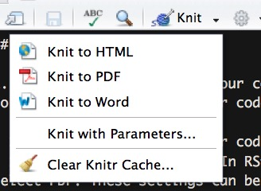
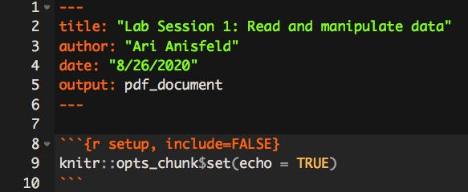

```{r setup, include=FALSE}
knitr::opts_chunk$set(echo = TRUE)
```

# Introduction to Rmds

## Intro to `Rmd`s (R Markdown documents).

1. Before getting started, run the following code in the console. This gives R the necessary tools to make pdfs from your `Rmd`s. 

    ```{r, eval = FALSE}
    # run in the console!
    install.packages("tinytex")
    # this will install additional software on your computer
    # that R needs to knit your Rmd to a pdf.
    tinytex::install_tinytex()
    ```

  Note: You never want to include include code that installs packages or use `View()` in a code chunk that is **evaluated** in an Rmd. When knitting you will get an error or worse create unusual behavior without an error.

2. Create an `Rmd` file. (In RStudio's menu `File > New File > R Markdown`). Name the document and select PDF. These settings can be changed later.
3. Save the `Rmd` in your coding lab folder as `final_project.Rmd`. 
4. New `Rmd`s come with some example code. Read the document and then knit to pdf by clicking the knit button. If `pdf` doesn't work, tell us. (You can usually knit to `html` as a worst case scenario.) 
  
    

      
      Pay attention to the syntax and ask your group or TA about anything you don't understand. `Rmd`s start with meta information which provides instructions to `knitr` on how to knit. After that, there's a normal code chunk which runs, but you won't see because of the `include=FALSE` bit at start of the code chunk. 
      

    
    Keep the part shown in the image above and erase the rest of the code and text in the document. This is how we start our own `Rmd` code.

5. Make a new code chunk by pressing Ctrl + Alt + I ( Cmd + Option + I on macOS).^[You can also type three tick marks with `{r}` and then another three tick marks. ] Then, add code to load the `tidyverse` in that chunk. 

\newpage

## Getting data for your final project.

The purpose of the rest of session 2 is to get you excited for your final project!!

As we said on Tuesday, you’ll know you’re ready for policy school coding, if you can open a data set of interest to you and produce meaningful analysis.

1. Read through the final project description linked on Canvas. 
2. What policy areas are you interested in? Are any of our suggested data sources aligned with your interests? Do you know of organizations that might collect data of interest to you? 


A good data set for this project will have enough observations (rows) that you need a computer to figure out what is going on! You should also be able to hypothesize about relationships between the variables (columns) in your data set.


3. Look for data! Google around etc. When you find something promising, try to load it into R. Try to find at least two options do you can be picky. (Give yourself at least 10 minutes to try the final section of the lesson.)
4. Use functions like `glimpse`, `name`, `nrow`, `ncol`, `summary` etc (see the lecture notes for more) to start getting a sense of your data.

Think about what it will take to address the questions and hypotheses you made. During the next three weeks, we'll help you make steps towards the goal! 

If you want this to be more of a challenge, we ask you to find two data sets that can be linked (e.g. both share a column like zip code); then you can use the textbook (chapter 13) to learn about how to join data sets. Be warned, going this route may require much self-study to deal with edge cases--but we will point you in the right direction!

## The first knit of your final project

1. Once you pick your data, make sure your code to load the data is in `final_project.Rmd`. Write a code block with something like this. Recall that the Rmd "knows" the directory it is in and treats that as the working directory. So the easiest way forward is to keep your data and your Rmd in the same folder.

```{r, eval = FALSE}
data <- read_xxx("my_data.xxx")
nrow(data)
ncol(data)
names(data)
```

1. Make sure you don't have any extraneous code. When we knit we don't want to try to run code like `View()` or `install.packages()`. If you have extraneous code you want to hang on to, open a new script to keep your scratch work.

1. Try to knit! If it fails, which is highly likely try to interpret the error message. Does it point you in the right direction? Another good idea is to open a new Rmd to see what the original example looked like. Did you put code in chunks? Do the chunks look formated the same as the example code? 

1. If kniting worked, look at the formating. Does it look professional? If not try to fix it. 
1. Add sections using `#` for the introduction, graph, table and appendix. 
1. Knit again.
1. Finally, when loading your data R prints out a bunch of information about your data set. We don't want to see those `messages`. To deal with this, use `message = FALSE` in your chunks header^[inside the brackets after `{r, message = FALSE }`]
1. Knit again to make sure it worked.


