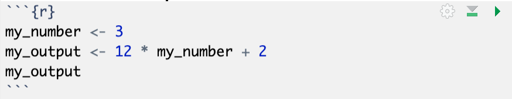
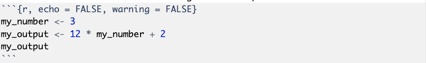
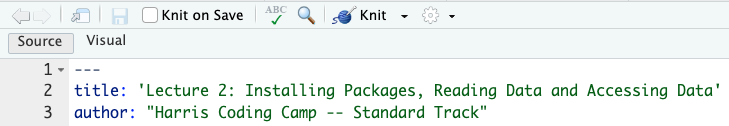

```{r, setup=TRUE, warning=FALSE, message=FALSE, echo=FALSE}
knitr::opts_chunk$set(echo = TRUE)
options(dplyr.summarise.inform = FALSE)
library(tidyverse)
library(readxl)
```

## Intro to R Markdown (`Rmd`)^[Source: https://ourcodingclub.github.io/tutorials/rmarkdown/]

- R Markdown allows us to create documents that serve as a neat record of our analysis. 
- Often, we want others to easily understand what we did in our analysis.
- R Markdown presents our code alongside its output (graphs, tables, etc.) with conventional text to explain it, a bit like a notebook.
- It helps create documents like .html or .pdf to display the headers, images, links etc. from plain text files, while keeping the original plain text file easy to read.
- Great cheat sheets: [Here](https://www.rstudio.com/wp-content/uploads/2015/02/rmarkdown-cheatsheet.pdf) and [here](https://www.rstudio.com/wp-content/uploads/2015/03/rmarkdown-reference.pdf)

## Create an R Markdown (.Rmd) file

To get R Markdown working in RStudio, the first thing we need is the `rmarkdown` package:

```{r, eval=FALSE}
install.packages("rmarkdown")
library(rmarkdown)
```

To create a new RMarkdown file (.Rmd), select File -> New File -> R Markdown, then choose the file type you want to create. 

For now we will focus on a .pdf Document, which can be easily converted to other file types later.

## Components of a .Rmd file
\footnotesize
An RMarkdown (.Rmd) file consists of several parts:

1. YAML header
 - stands for “yet another markup language”
 - controls settings that apply to the whole document (e.g., “output” should be pdf, whether to include tables, etc.)
 - goes at very top of document
 - starts with a line of three horizontal dashes `---` ; ends with a line of three horizontal dashes `---`
 
2. Text in the body of .Rmd file
 - e.g., headings; description of results, etc.
 
3. Code chunks in the body of .Rmd file

4. Output associated with code chunks

## YAML header

By default, this includes a title, author, date and the file type you want to output to. 

This is the minimum you should put in your header section. Many other options are available for different functions and formatting, see [here](https://bookdown.org/yihui/rmarkdown/pdf-document.html) for .pdf options.

```{r, eval=FALSE}
---
title: "Introduction to Rmd -- Coding Camp"
author: my name
date: August 30, 2023
output: pdf_document
---
```

## Code chunks

Below the YAML header is the space where you will write your code, accompanying explanation and any outputs. 

Code that is included in your .Rmd document should be enclosed by three backwards apostrophes (tick marks). These are known as **code chunks** and look like this:

  {})

You can run an individual chunk of code at any time by clicking on the small green arrow. The output of the code will appear just beneath the code chunk.

## More on code chunks

If you don’t want the code of a particular code chunk to appear in the final document, but still want to show the output, include `echo = FALSE` in the code chunk instructions.

  {}   

In some cases, when you load packages into RStudio, various warning messages might appear. If you do not want these warning messages to appear, you can use `warning = FALSE`.

## Knit the `Rmd` file and create the pdf document

RStudio uses LaTeX to make .pdf documents.

The easiest way to use LaTeX is to install the `TinyTex` package. Run these line in the console:

```{r, eval=FALSE}
install.packages("tinytex")
tinytex::install_tinytex()
```

To compile your .Rmd file into a .pdf document, you should press the **Knit** button in the taskbar:

  {}
        
By default, a preview window appears, and a pdf file is also saved to the same folder where you saved your .Rmd file.