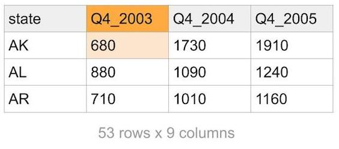
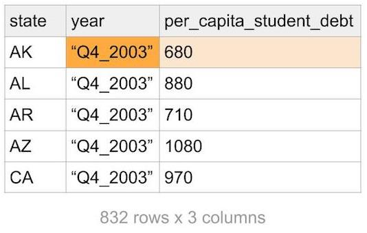
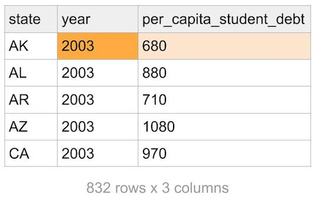
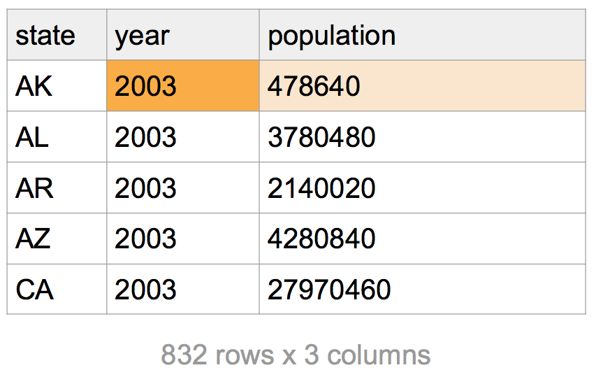
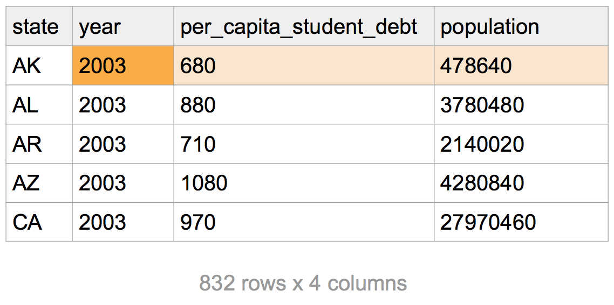

```{r setup, include = FALSE}
library(tidyverse)
library(readxl)
student_loan_debt <- read_csv("data/student_loan_debt.csv")
population <- read_csv("data/population.csv")
```


Complete the following lab in an Rmd. In your `setup` chunk, load tidyverse and readxl.

We'll work with the following [`data set`](https://github.com/harris-coding-lab/accelerated_lab_2022/raw/main/Labs%20(accelerated)/Lab%205/data/area_report_by_year.xlsx?raw=true). Download it and put the data in the appropriate folder. The data comes from the [NY Fed databank](https://www.newyorkfed.org/microeconomics/databank.html)


# Warm up

1.

  a. In class, you learned about `head()`. What if you wanted to get the tail end of your data instead?
    
  *Solution:* `tail()`
  
  b. Use vector coercion^[`as.___()`] to make `c("1", "3", "4") + 4`  produce `c(5, 7, 8)`.
  
  *Solution:* `as.numeric(c("1", "3", "4")) + 4`
  
  c. The code produces the same result  `1:4 %in% c(1, -4) ` and `1:4 == c(1, -4)`.  But they are not logically equivalent! Provide a counterexample.
  
  *Solution*: Vector recycling issue! `1:4 %in% c(1, 3) ` and `1:4 == c(1, 3)`
  
  d. Are the following logically equivalent? `1:4 %in% c(1, -4)` and `1:4 == 1 | 1:4 == -4` If yes, why? If no, provide a counter example.
  
  *Solution:* THese are logically equivalent because both test whether each element is `1` or `-4`
  
  
2. Recall our `dplyr` verbs. 

- mutate() - filter() - select() - arrange() - summarize()

What is the purpose of each function?


3. For the next few problems  you'll translate base R code to `dplyr` code.
We want to have identical output. We use `midwest` a data set that is avaiable when you load `tidyverse`.

a. 
```{r, eval = FALSE}
low_density_counties <- midwest[midwest$popdensity < 120, 
                       c("county", "state", "poptotal", "area")]

low_density_counties[order(low_density_counties$poptotal,
                           decreasing = TRUE), ]
```

```{r, eval = FALSE}
# Solution
midwest %>%
  filter(popdensity < 120) %>%
  select(county, state, poptotal, area) %>%
  arrange(desc(poptotal))
```


b. Here we analyze poverty data. Notice that some counties are missing the poverty status for a large portion of the population. When missing data, one way to put a bound on the estimate is to consider the extreme events. Either **all** the non-responses have incomes below the poverty line or **none** do.

Write the following base R code as tidyverse code. 

```{r chunk, eval = FALSE}
midwest$poverty_unknown <- 100 - midwest$percpovertyknown
midwest$low_estimate <- round(midwest$percbelowpoverty)
midwest$high_estimate <- round(midwest$percbelowpoverty + midwest$poverty_unknown)

out <- midwest[midwest$high_estimate > 35, 
        c("county", "state", "low_estimate", "high_estimate")]

out
```

**Solution: see Challenge solution below**


c. **Challenge:** You look at the data again and realize the previous code is not correct. The percent below poverty and the percent of unknown/known poverty status are based on different populations! 

Compare: 

$$ \text{Perc. known status} = \frac{\text{N known status}}{\text{Total population}}$$
 with
 
$$  \text{Perc. below poverty} = \frac{\text{N below poverty}}{\text{N known status}} $$

After finishing the rest of the lab, come back and try to code this up. The result should match our table.^[To develop intuition, consider a county with 1000 people with 90\% known poverty status. Thus, `N known status = 1000 * .9 = 900` and 100 without a known status. Further, let the perc below poverty be 10\%. This implies `N below poverty = 900 * .1 = 90`.  Now, how do we bound the poverty rate? Consider 100 people with unknown status. At the extreme, all of them are below the poverty line and 190 residents below the line *or* zero of them are below the poverty line and 90 residents are below the poverty line. Thus the bounds are $\frac{90}{1000} - \frac{190}{1000}$ or 9 to  19 percent. With the erroneous method, we'd say the range was between 10 and 20 percent. ]

```{r, echo = TRUE}
# SOLUTION
midwest %>%
  mutate(n_known_status = poppovertyknown,
         n_below_poverty = n_known_status * percbelowpoverty / 100,
         n_unknown_status = poptotal - n_known_status,
         low_estimate = 100 * n_below_poverty / poptotal,
         high_estimate = 100 * (n_below_poverty + n_unknown_status) / poptotal) %>%
  filter(high_estimate >= 35) %>%
  select(county, state, low_estimate, high_estimate) %>%
  mutate_if(is.numeric, round)
```


d. Convert these to tidyverse code to make a summary of the data. 

```{r}
identical(
  tibble(county_mean_perc_below_poverty = round(mean(midwest$percbelowpoverty), 1),
       county_mean_perc_below_child_poverty = round(mean(midwest$percchildbelowpovert), 1)),
  
  # SOLUTION
  summarise(
    midwest, 
      county_mean_perc_below_poverty = round(mean(percbelowpoverty), 1),
      county_mean_perc_below_child_poverty = round(mean(percchildbelowpovert), 1)
      )
)  

```

e. Notice the means above are the means of *county* poverty rates, which is not the same as the poverty rate for the population in our data.^[To see why, imagine a state with one highly populated county with a high poverty rate (50 percent) and 99 counties each with 1 person whose income is above the poverty. The average of county poverty rates will be small (.5 percent), while the state poverty rate might could be close to 50 percent.] Write code to calculate the poverty rate for the `midwest` using the formula for "$\text{Perc. below poverty}$" shown above.^[Hint: notice the numerator and denominator are both sums.]

```{r, echo = TRUE}
# SOLUTION
midwest %>%
  mutate(n_below_poverty =  poppovertyknown * percbelowpoverty / 100) %>%
  summarize(n_below_poverty = sum(n_below_poverty),
            n_poverty_known = sum(poppovertyknown),
            perc_below_poverty = round(100 * n_below_poverty / n_poverty_known, 1))
```


# Analyzing Student Loan Debt

1. Load data. Mine is stored in the `data` folder inside the folder with my Rmd.

```{r, message = FALSE, eval = FALSE}
fed_data <- read_xlsx("data/area_report_by_year.xlsx")
```

*Remark:* Recall Rmds know what folder they are in and make it the working directory. So, R looks for a `data` folder in the working directory and then for the data file in that folder. You could also give R an *absolute* file path, such as: `"/Users/username/Coding Lab/labs/data/area_report_by_year.xlsx"`, but your code would be harder to share.

2. Look at `fed_data` and notice there are some issues!  Run the code below to fix the issues. We want you to see what data prep looks like and will explain this step-by-step!


```{r clean, eval=FALSE}
library(tidyverse)
library(readxl)

# CAREFUL with copy paste from pdfs. The quotes "" might change!
# We provide an R script with this code on canvas if you are having trouble.
# (And links to the resulting csv)
student_loan_debt <- 
  read_xlsx("data/area_report_by_year.xlsx", 
            sheet = "studentloan", 
            skip = 3) %>%
    filter(state != "allUS")  %>%
    pivot_longer(cols = -state, 
                 names_to = "year", 
                 values_to = "per_capita_student_debt") %>% 
    mutate(year = str_sub(year, 4, 7),
           year = as.numeric(year))

write_csv(student_loan_debt, "data/student_loan_debt.csv")
```


## Data Cleaning: Step by step 
 
**1: read what we need**
```{r clean1, eval=FALSE}
student_loan_debt <- read_xlsx("data/area_report_by_year.xlsx", 
                               sheet = "studentloan", 
                               skip = 3) 
```

We tell `read_xlsx` to specify the `sheet` in the Excel workbook we want to read, and we `skip` the first 3 rows in the sheet, because the data we're interested in starts on line 4.

{width=30%}

**2: filter out unwanted data**
```{r clean2, eval=FALSE}
filter(state != "allUS")
```

We **filter out rows of data** that are for the entire US, leaving only rows that refer to states.


**3: tidy our data**

```{r clean3, eval=FALSE}
pivot_longer(cols = -state, names_to = "year", values_to = "per_capita_student_debt") 
```

 We **convert the data from a wide to a long format**, so that `year` is a variable and `per_capita_student_debt` is also a variable. This will makes analysis easier.^[Read more about [tidy data](https://r4ds.had.co.nz/tidy-data.html#introduction-6) in R for Data Science.)]

{width=30%}

**4: clean up year**
```{r clean4, eval=FALSE}
mutate(year = str_sub(year, 4, 7),
       year = as.numeric(year))
```

We use **string manipulation** to modify the `year` column, and then **convert the type** of the column.

{width=30%}

5. **Write the data for future use**

```{r clean5, eval=FALSE}
write_csv(student_loan_debt, "data/student_loan_debt.csv")
```

We write the cleaned data to a CSV (comma-separated variables file).


Try running this code locally on your computer! If it fails, the csv is [here](https://raw.githubusercontent.com/harris-coding-lab/accelerated_lab_2022/main/Labs%20(accelerated)/Lab%205/data/student_loan_debt.csv) and you can load by reading the csv directly from the url.


## Exploratory Data Analysis

**Note**: `student_loan_debt` can be long to type, so use **Tab-Autocomplete**. Once you start typing the variable in the function, press **Tab** and wait for the variable name to automatically pop up. Press **Tab** again or **Enter** to fill in `student_loan_debt` (or click on it).


### Arranging Data

We can use the `arrange()` function from `dplyr` to sort the student loan data. The syntax is `arrange(data, variables)` or `data %>% arrange(variables)`.  

- What state or territory had the lowest per capita debt in our data? 
- How much was the lowest per capita debt and what year did it occur?
- How much was the highest per capita debt?
- What years does this data cover?

After ensuring `arrange` works as you expect, pipe the output to `head(1)` to only print the first row to answer the questions.

```{r arrange, include = TRUE}
# SOLUTION
student_loan_debt %>%
  arrange(per_capita_student_debt) %>%
  head(1)

student_loan_debt %>%
  arrange(desc(per_capita_student_debt))  %>%
  head(1)

student_loan_debt %>%
  arrange(year) %>%
  head(1)

student_loan_debt %>%
  arrange(desc(year)) %>%
  head(1)
# sometimes there's a more direct solution than sorting!
range(student_loan_debt$year)
summary(student_loan_debt$year)  
student_loan_debt %>% 
  summarize(earliest = min(year), 
            latest = max(year))
```


### Filtering Data

Recall that filter takes `data` and then "row conditions", formally logical vectors of length `N = nrow(data)`.

```{r filter, eval = FALSE}
# filter student_loan_debt so we have 
# rows with per_capita_student_debt less than 800
filter(student_loan_debt, per_capita_student_debt < 800)
```
Notice that with clear names, we can read the code as if it's English!

1. Write a `filter` statement to get all states with an average per capita student debt of 10000 or higher in the year 2020 or 2021. Recall, you can combine multiple criteria - just add a comma and another filtering criteria! This is equivalent to the logical *AND*.^[**Hint:** We expect two rows.Your code should look like this: `filter(data, condition1, condition2)` or `data %>% filter(condition1, condition2)`]

```{r filter2, include = TRUE, eval = FALSE}
# SOLUTION
student_loan_debt %>%
  filter(year >= 2020, per_capita_student_debt >= 10000)
```


2.  Get the rows for Illinois (IL) since 2012 *OR* for California (CA) from 2013 on. (The resulting data frame should have 19 rows).

```{r filter3, include = TRUE, eval = FALSE}
# Solution
student_loan_debt %>%
  filter(state == "IL" & year >= 2012 |
         state == "CA" & year >= 2013)
```

3.  `filter` is great for helping us figure out where the missing values are in our data. Your friend wrote the following code and decide there are no missing values. But you know there are!


```{r, echo = TRUE}
# your friend's code
student_loan_debt %>% 
  filter(per_capita_student_debt == NA)

# your code
student_loan_debt %>%
  filter(state == "PR", year >= 2018) 
```

Explain the discrepenacy and then write code to find all the rows with missing data! 

```{r filter-na, include = TRUE, eval = FALSE}
# SOLUTION: 
filter(student_loan_debt, is.na(per_capita_student_debt))
```


### Summarizing data

1. Collect the data for the year 2016 and use summarize to calculate the min, max, mean and median of `per_capita_student_debt`.
2. Repeat the exercise for 2021. 


```{r, include=TRUE}
# Solution
student_loan_debt %>%
  filter(year == 2016) %>%
  summarize(min = min(per_capita_student_debt),
            mean = mean(per_capita_student_debt),
            median = median(per_capita_student_debt),
            max = max(per_capita_student_debt),)
```

```{r, include=TRUE}
# Solution
student_loan_debt %>%
  filter(year == 2021) %>%
  summarize(min = min(per_capita_student_debt),
            mean = mean(per_capita_student_debt),
            median = median(per_capita_student_debt),
            max = max(per_capita_student_debt))
```

3. Notice anything strange about the year 2021? We get `NA` for everything! Recall `NA`s are contagious. Let's make sure we understand how to proceed with a simple example.  

```{r group5}
# Adjust the call to remove the `NA` and return a mean of 2.
mean(c(NA, 1, 2, 3))
```

4. What is the mean per capita debt in 2021 if we exclude NAs? 

```{r, include = TRUE}
# Solution
student_loan_debt %>%
  filter(year == 2021) %>%
  summarize(min = min(per_capita_student_debt, na.rm=TRUE),
            mean = mean(per_capita_student_debt, na.rm=TRUE),
            median = median(per_capita_student_debt, na.rm=TRUE),
            max = max(per_capita_student_debt, na.rm=TRUE))
```


### Bringing in population data

We saw that DC has the highest level of per-capita student loan debt. However, you might wonder how much *total* student debt is held by the capital's residents. To tackle this, we need a population dataset. Fortunately, in the `area_report_by_year.xlsx` there is a sheet called "population", which refers to the number of individuals over 18 years of age who have a credit report with Equifax.

1. The data is stored in exactly the same way as the student loan data.^[If you had to download our csv, here's the [link for population.csv](https://raw.githubusercontent.com/harris-coding-lab/accelerated_lab_2022/main/Labs%20(accelerated)/Lab%205/data/population.csv)] This implies you can reuse the code from before with a few (precisely 2) modifications. Copy and paste your code from before and make the modifications. The  result looks like this:

{width=30%}

2. To join the data together you can use the following code.

```{r join}
joined_data <- 
  student_loan_debt %>%
    left_join(population, by = c("state", "year"))
```

We link the two dataframes to each other when they have the same `state` and `year` values.^[The base R function is `merge()`.] 

The joined data looks like this (note the extra column):

{width=30%}

### How much student debt is held in each state?

1.  Now, we need to create a new column! What tidyverse verb do you use? Calculate the total student debt in a state. (pop x debt/person = total debt) and be sure to assign the output to the name `total_student_debt_data`.

```{r reweight1, include = TRUE}
# SOLUTION
total_student_debt_data <- 
  joined_data %>%
    mutate(total_student_debt = population * per_capita_student_debt,
           total_student_debt = round(total_student_debt/1e9, 1))
```

Take a look at the results.

2. The values are hard to read because they're such big numbers. Adjust the values so that they're in billions of dollars.^[e.g. 15230000000 becomes 15.2 (billion)]
Go back to where you originally created `total_student_debt_data` and add the adjustment to that code.

  *Solution*: see above
  
```{r, eval = FALSE, include = FALSE}
#  for example my code looks like 
total_student_debt_data <- 
  joined_data %>%
    mutate(total_student_debt = _______________, # first multiply the columns
           total_student_debt = _______________) # then adjust the column so 
                                                 # it's easier to communicate

```

*Remark:* It's a good idea to keep code that does similar stuff to your data together. 


3. Let's add a ranking column to see where DC falls. The built in `rank()` function will come in handy. Let's explore it first. 

```{r, eval = FALSE}
y <- c(5, 7, 7, 9, 1)

exploring_rank <- 
tibble(y = y,
       rank = rank(y))

exploring_rank %>% arrange(y)
```

What is `rank()` default method for dealing with ties? Add columns to your example where we use different tie methods. (You know where to go for help `?rank`!)

4. Focus on 2021, where is DC in this ranking? (Add a column with the rank number!) You may have gotten rank = 10, that's not exactly what you want ...^[You want bigger numbers to have lower ranks; you can use the same function we use with `arrange()` to make it happen.]

```{r, include = TRUE}
# SOLUTION
total_student_debt_data %>%
  filter(year == 2021) %>%
  mutate(rank = row_number(desc(total_student_debt))) %>% 
  filter(state == "DC") 
```


## Exploring with visualization

We'll tease data visualization methods in labs, and go over them in detail soon.


1. We want you to make a plot with top 4 states in terms of total debt. Prepare the data and then make the plot.

```{r, eval = FALSE, include = FALSE}
# you should get the same plot as we do below.
  ggplot(data = __________, 
         aes(x = year, 
             y = total_student_debt,
            color = state)) + 
  geom_line() +
  labs(y = "Total student debt in billions")
```


```{r, echo = TRUE, out.width=300}
# SOLUTION
total_student_debt_data %>%
  filter(state %in% c("CA", "TX", "FL", "NY")) %>%
  ggplot(aes(x = year, 
             y = total_student_debt,
              color = state)) + 
  geom_line() +
  labs(y = "Total student debt in billions")
```

2. Notice that New York changes it's ranking over time. This can be driven by either a slowing population growth *or* a decline in per capita borrowing (or both). Copy and paste the ggplot code and change the `y` variable to make two new plots.

```{r, echo = TRUE, out.width=300}
# SOLUTION: population example
total_student_debt_data %>%
  filter(state %in% c("CA", "TX", "FL", "NY")) %>%
  ggplot(aes(x = year, 
             y = population,
              color = state)) + 
  geom_line() +
  labs(y = "Total student debt in billions")
```


3. Finally, if you have time, go back and try the challenge problem from the warm-up.


## Appendix: Reading population data

Here's the code used to clean the population data:

```{r cleanpop, eval=FALSE}

# Rather than copy and paste this code.
# Copy your earlier code and make two adjustments

population <- 
  read_xlsx("data/area_report_by_year.xlsx", 
            sheet = "population",  # Change the sheet
            skip = 3)  %>%
  filter(state != "allUS") %>%
  pivot_longer(cols = -state, 
               names_to = "year", 
               values_to = "population") %>%  # change the name of the column.
  mutate(year = str_sub(year, 4, 7),
         year = as.numeric(year))

write_csv(population, "data/population.csv")
```