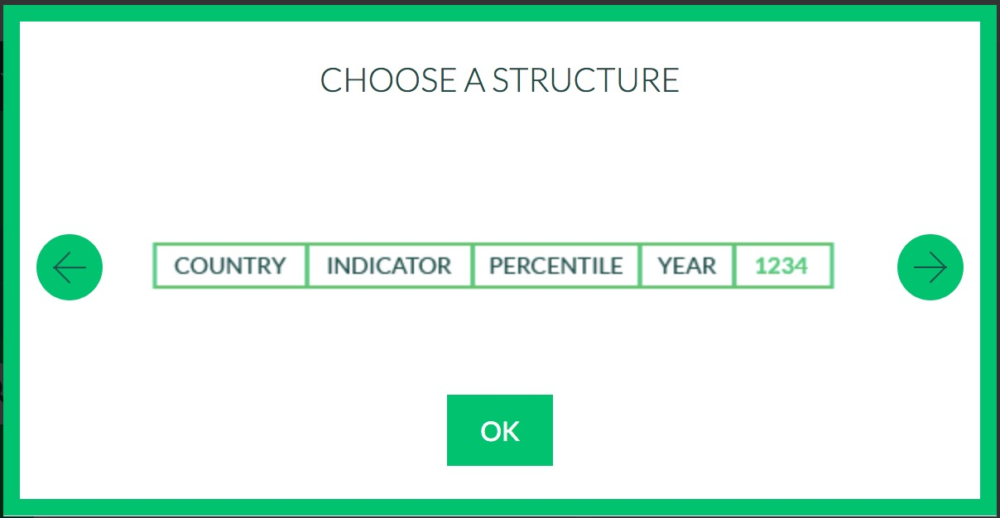

```{r, include = FALSE}
library(tidyverse)
library(readxl)
wid_data_raw <-   read_xlsx("../data/world_wealth_inequality.xlsx",
                        col_names = c("country", "indicator", "percentile", "year", "value")) %>%
      separate(indicator, sep = "[\\r]?\\n", into = c("row_tag", "type", "notes", "empty")) 
```


For this assignment we'll use the world inequality database to investigate wealth shares of different income brackets in various countries. Download the data [here](https://github.com/harris-coding-lab/accelerated_lab_2022/raw/main/Labs%20(accelerated)/Data/world_wealth_inequality.xlsx).  The original source data comes from https://wid.world/ which has updated it's data products since we made this lab!


# Warm-up


1. Without running the code, predict what the output will be. Then, see if you were right by running the code in the console.
```{r eval=FALSE}
x <- c(1.1, 2.2, 3.3, 4.4, 5.5)

x
x[]
x[5]
x[c(3, 1)]
x[c(4,4,4)]
x[3:5]
x[-1]
x[-c(3,1)] 
x[c(TRUE,TRUE,FALSE,FALSE,TRUE)]
x[x>3]
```

2. Without running the code, predict what the output will be. Then, see if you were right by running the code in the console. (You can `glimpse(midwest)` to recall what the data looks like. How many rows and columns are there?)

*Two of these will cause errors.*  Why? 


```{r, eval = FALSE}
midwest[1:4]
midwest[c(1,2,3,4)]
midwest[c(13,7)]
midwest[38]
midwest[38,]
midwest[,38]
midwest[1:5, ]
midwest[, c(1,2,3)]
midwest[1:437 > 433,]
midwest[50:52, c(10,20)]
```

Note: if you try to knit code that produces an error, your knitting will fail. You can use `#` to comment out such code or use eval= FALSE (e.g. `{r, eval = FALSE}`).

3. a. What does the `distinct(midwest, state)` do? 
   b. What does `unique(midwest$state)`? 
   c. How are they different? 
   d. Which function do you think is from `dplyr` and what are some patterns that make it similar to the `dplyr` verbs?


  *Solution:* Both functions isolate the distinct/unique states in the `midwest` data. `distinct` is a dplyr function; like other dplyr functions it takes data in the first position and accepts `...` afterwards, an arbitrary number of columns, and returns a dataset. `unique` takes a vector as input and returns a vector.

4. Which of the following code works? Can you think of two additional strategies to get filter the data so we only have data from IA, IL, MI and WI using `filter`?

```{r, eval = FALSE}
# SOLUTION
midwest %>%
  filter(state == "IA", "IL", "MI", "WI")

midwest %>%
  filter(state == c("IA", "IL", "MI", "WI"))

# This one works!
midwest %>%
  filter(state == "IA"| state ==  "IL"|
         state == "MI"| state =="WI")

# Two other options
filter(midwest, state %in% c("IA", "IL", "MI", "WI")),
filter(midwest, ! state %in% c("IN", "OH"))

```


# World Inequality Database

For this assignment we'll use the world inequality database to investigate wealth shares of different income brackets in various countries.


Load the data with the name `wid_data_raw`. 

  - Make sure you know what folder the data is in relative to your notebook.
  - Pay attention to the file type.


## Adding a header

What's up with the column names? Open the excel file, you'll see there are no headers! 

The columns should be named like so.


```{r, echo = FALSE, out.width=300}

```

You may be tempted to change the data, but we prefer to make our process reproducible!
Fortunately, we can create our own header in `read_xlsx`. 

```{r, eval = FALSE}
wid_data_raw <- 
  read_xlsx("world_wealth_inequality.xlsx", 
                    col_names = c("country", "indicator", "percentile", "year", "value")) 
```

1. Update your read_xlsx call to add `col_names`.

*Remark:*  Now when we look at the second column. It's a mess. However, there's a tidyverse function
`separate` that comes in hand here. This come from `tidyr` which we only have time for a taste of.^[Other high use functions are `pivot_longer()` and `pivot_wider()` for re-shaping data to make it "tidier".]


"The goal of tidyr is to help you create tidy data. Tidy data is data where:

- Every column is variable.
- Every row is an observation.
- Every cell is a single value."^[https://tidyr.tidyverse.org]


Here we have multiple values in the `indicator` column. `seperate` allows us to use patterns in the data
to split the data `into` distinct columns. Here, we can separate it based on where the `\n` are.^[Windows users: On some Windows computer you might see `\r\n` instead of `\n`]

*Example:* Let's start with a tiny example.
```{r}
# Our data is very mess! 
example <- 
  tibble(indicator = 
           c("stuff\nmore stuff\neven more stuff\n",
             "shweal_p99p100_z_CN\nNet personal wealth\nTop 1% | share\n"))


separate(
  data = example, # data is in the first position so this is pipe-able.
  col =  indicator, 
  sep = "\\n", # sep is the "seperator" for reasons beyond 
               # coding lab; we need \\n instead of \n.
  into = c("col a", "col b", "col c", "empty") #  into is the new col names
)
```
 
 
Since there's are 3 `\n` to split on, we end up with *4* strings.^[We see that sep is `"\\n"`. This is called a "regular expression" which allow us to flexibly match sequences of characters in text. For example, you'll see `"[\\r]?\\n"` below, which says look for `"\r\n"` or `"\n"`.] The last string is always empty. If we ignored the final string and wrote `into = c("col a", "col b", "col c")` we would get a lot of warnings, which we could also ignore. 


1. Add a call to `separate` to tidy your data. `separate` takes data as it's first argument, so we can pipe our imported data into it.
    
```{r, eval = FALSE}
wid_data_raw <- 
  read_xlsx("world_wealth_inequality.xlsx", 
            col_names = c("country", "indicator", "percentile", "year", "value")) %>% 
  # here sep is includes [\\r]? so that the code works on windows or mac!
  separate(indicator, sep =  "[\\r]?\\n", 
           into = c("row_tag", "type", "notes", "empty")) 


```


### clean-up

We want a clean reproducible code so you should just have one block of code to read the data: that last one. The other code were building blocks. If you want to keep "extra" code temporarily in your script you can use `#` to comment out the code. 

## manipulating world inequality data with `dplyr` 

Now we have some data and are ready to use `select()`, `filter()`, `mutate()`, `summarize()` and `arrange()` to explore it.

1. The data comes with some redundant columns that add clutter when we examine the data.  What `dplyr` verb let's you choose what columns to see?  Remove the unwanted column `row_tag` and `empty` and assign the output to the name `wid_data`.

    ```{r, include = TRUE}
    # SOLUTION
    wid_data <- wid_data_raw %>% select(-c(row_tag, empty))
    ```

1. Let's start to dig into the data. We have two `type`s of data: "Net personal wealth" and
"National income". Let's focus on "Net personal wealth" for France. Create a data set called `french_data` with the desired rows and then run the code below to visualize the data.^[We expect to see 4 lines and to get a message about several warnings.] 

```{r, echo = TRUE}
# SOLUTION
french_data <- wid_data %>% 
                filter(type == "Net personal wealth", country == "France") %>%
                mutate(perc_national_wealth = value * 100)
russian_data <- wid_data %>% 
  filter(type == "Net personal wealth", country == "Russian Federation") %>%
  mutate(perc_national_wealth = value * 100)
```

```{r, eval = TRUE}
# SOLUTION
french_data %>%
  ggplot(aes(y = value, x = year, color = percentile)) +
    geom_line()  + 
    geom_point()
```

Now we're getting somewhere! The plot shows the proportion of national wealth owned by different segments of French society overtime. For example in 2000, the top 1 percent owned roughly 28 percent of the wealth, while the bottom 50 percent owned about 7 percent. 

1. Explain the gaps in the plot. Using `filter()`, look at `french_data` in the years between 1960 and 1970. Does what you see line up with what you guessed by looking at the graph?

```{r, eval = FALSE}
# SOLUTION
french_data %>%
  filter(between(year, 1960, 1970)) # short cut for   1960 >= x & x =< 1970
```


1. Create a new column called `perc_national_wealth` that equals `value` multiplied by 100. Adjust the graph code so that the y axis shows `perc_national_wealth` instead of `value`.

```{r, include = TRUE}
# Solution: See above
```


1. Now following the same steps, explore data from the "Russian Federation". 

```{r, include = TRUE}
# Solution: See above
```

1. The data for "Russian Federation" does not start in 1900, but our y-axis does. That's because we have a bunch of `NA`s. Filter out the `NA`s and remake the plot. 

```{r, include = TRUE}
# SOLUTION
russian_data %>%
  filter(!is.na(value)) %>%
  ggplot(aes(y = perc_national_wealth, x = year, color = percentile)) +
    geom_line()  + 
    geom_point()
```


1. What year did the bottom 50 percent hold the least wealth? What year did the middle 40 percent hold the most wealth?

```{r, include = TRUE}
# SOLUTION
russian_data %>%
  filter(percentile == "p0p50") %>%
  arrange(value) %>%
  head(1) %>%
  select(percentile, year)

russian_data %>%
  filter(percentile == "p50p90") %>%
  arrange(desc(value)) %>%
  head(1) %>%
  select(percentile, year)
```

```{r, include = TRUE}
# SOLUTION
russian_data %>% 
  # this step is logical, but not necessary in practice
  filter(percentile == "p0p50") %>%
  filter(perc_national_wealth == min(perc_national_wealth, na.rm=TRUE)) %>%
  head(1) %>%
  select(percentile, year)


russian_data %>% 
  # this step is logical, but not necessary in practice
  filter(percentile == "p50p90") %>%
  filter(perc_national_wealth == max(perc_national_wealth, na.rm=TRUE)) %>%
  head(1) %>%
  select(percentile, year)
```

1. How many years does the Russian top 1 percent control more money then the 90th to 99th percentile?^[Suggestion: you may need to work with vectors directly.]

```{r, include = TRUE}
# SOLUTION
top1 <- russian_data %>%
  filter(percentile == "p99p100") %>%
  pull(perc_national_wealth)
  

top10 <- russian_data %>%
  filter(percentile == "p90p100") %>%
  pull(perc_national_wealth)

sum(top10 - top1 < top1, na.rm = TRUE)
```


1. For both the Russian Federation and French data, calculate the average of the proportion of wealth owned by the top 10 percent over the period from 1995 to 2010. You'll have to choose the relevant rows and then summarize with `summarize()`.

```{r, echo = TRUE, eval = FALSE}
# SOLUTION
french_data %>% 
  filter(percentile == "p90p100") %>% 
  filter(between(year, 1995, 2010)) %>% 
  summarize(top10 = mean(perc_national_wealth))

russian_data %>% 
  filter(percentile == "p90p100") %>% 
  filter(between(year, 1995, 2010)) %>% 
  summarize(top10 = mean(perc_national_wealth))
```

1. Now say you want to compare France and Russia to the other countries in the database. There has to be an easier way to do this analysis without copying and pasting so much! 

Introducing `group_by` you can use `group_by` to divide your data into smaller data sets determined by the `grouping` columns. Here we `group_by(country)` which tells R to treat `wid_data` as if it were made up of 8 distinct country data sets (i.e. `french_data`, `russian_data`, `indian_data` etc.) Then when we call `summarize()` it summarizes each of those data sets and puts the results into a single tibble!

```{r}
wid_data %>%
  mutate(perc_national_wealth = value * 100) %>%
  filter(percentile == "p90p100", between(year, 1995, 2010)) %>% 
  group_by(country) %>%
  summarise(top10 = round(mean(perc_national_wealth, na.rm=TRUE)))
```

2. What happens if you group by country and year before summarizing?

We'll return to this idea soon, but take some time to experiment with it. 


# FYI: Data manipulation 3 ways.

In addition to `dplyr` and base R `[`, you may occasionally see code where a partner or professor uses base R functions that have similar functionality to `dplyr`. 

1. What two dplyr verbs does `subset()` do in the same function call? Look at the examples in help.

**filter() and select()**

2. There's a function called `within()`. What `dplyr` verb has the same functionality?

**mutate()**

```{r, eval=FALSE}
within(txhousing, 
       {
        mean_sales_price <- round(volume / sales) # notice no comma
        best_month_sales_price <- max(mean_sales_price, na.rm=TRUE)
       })
```

3. The base R analog is `aggregate` here's two examples of getting the "mean perc_national_weath". 

```{r}

wid_data_for_agg <- 
  wid_data %>%
  mutate(perc_national_wealth = value * 100) %>%
  filter(percentile == "p90p100", between(year, 1995, 2010))


aggregate(wid_data_for_agg$perc_national_wealth,
          by = list(wid_data_for_agg$country), 
          FUN = mean,
          na.rm = TRUE)

aggregate(perc_national_wealth ~ country, 
          FUN = mean, 
          na.rm = TRUE,
          data = wid_data_for_agg)
```
Try to adjust this call to do the aggregation at the county by year level.


## Challenge:

1. Repeat the `wid_data` analysis above for Korea using `[`s.
2. Ask your own question of the data and try to answer it.


<!--## Challenges.

1. The IRS releases [zip code level data](https://www.irs.gov/statistics/soi-tax-stats-individual-income-tax-statistics-zip-code-data-soi) about tax filers.


```{r}
irs2017 <- read_csv("https://www.irs.gov/pub/irs-soi/17zpallagi.csv")
irs2012 <- read_csv("https://www.irs.gov/pub/irs-soi/12zpallagi.csv")
```

-->