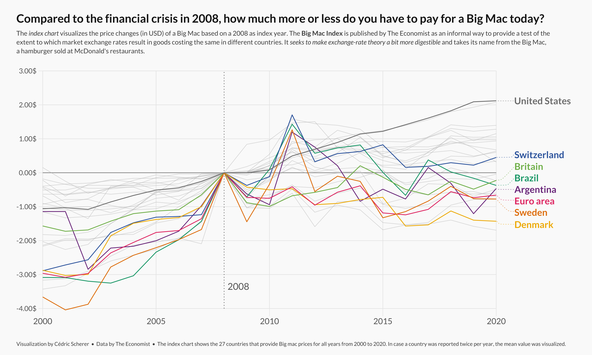
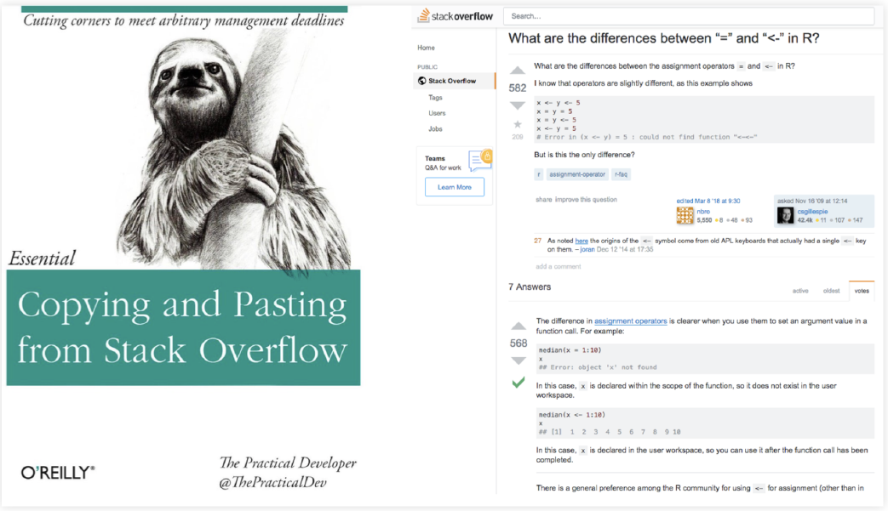
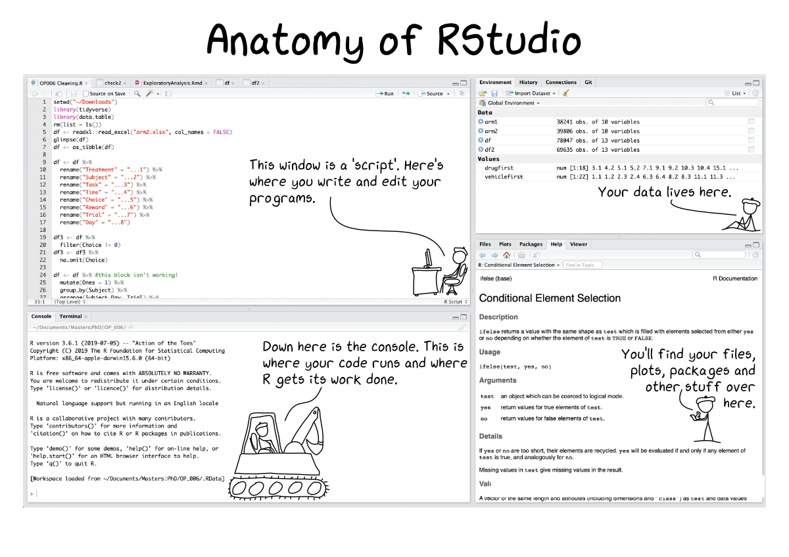

```{r, setup=TRUE, include=FALSE}
knitr::opts_chunk$set(echo = TRUE)
options(dplyr.summarise.inform = FALSE)
library(tidyverse)
library(readxl)
```

# Who are we and why are we here?

## Teaching Members 

- Instructors
  - Standard Track: Arthur Cheib, Sheng-Hao Lo
  - Accelerated Track: Ari Anisfeld
\newline
- Head TA: Rubina Hundal
  - All logistics issues
\newline
- You will also have several TAs who will be helping you along the way!
  - TA sessions
  - Canvas Discussion Board

## Why learn coding?

Policy jobs and the Harris curriculum rely on coding

- to quickly engage with policy data
- to conduct statistical analyses 
- to make transparent, reproducible analyses


Examples

- Determine number of people eligible for debt relief
- Measure impact of debt forgiveness on future aid take-up


**What policy problems do you want to tackle with data?**

## Gauging your background 

Most of you have some data experience. What are you bringing?

- Excel / Sheets
- Stata
- R
- Python 
- C++? Julia? SPSS? SAS? Other software / languages? 
- Excited for a challenge?

## Why R?

- R is a powerful programming language and statistical software environment
    - Great data manipulation and visualization suite
    - Strong statistical packages (e.g. program evaluation, machine learning)
- Open source and free
- Complete programming language with low barriers to entry

- We will use R for the entire Stats sequence in Fall and Winter


# What will I learn?

## This is just the beginning!

Camp covers:

0. Motivation/Installation of R *[Today]*
1. Installing Packages and Reading Data *[Today]*
2. Basic Data Manipulation and Analysis *[3]*
3. Data Visualization *[1]*
4. More on Data Manipulation *[3]*
    - Grouped Analysis, Iteration, Functions

In Stats 1/2 and other courses, you will build off of these lessons


## Learning philosophy

- You are learning a (new) language

- Coding can be frustrating 

- Coding requires a different modality of thinking 

- We learn by producing code and experimenting


**Coding lab is for you**


## How will we progress?

1. Live lectures:

  - Focus on main idea first
  - Try it yourself -- you learn coding by coding!
  
2. Practice in TA sessions (Most important part!):

  - Learn coding by coding!
  - Work on problems with peers and have TA support
  
3. Additional help:

  - logistics: email Head TA
  - coding: Post questions to Canvas Discussion Board 
  
4. Final project

## Final project (optional)

  You'll know you're ready for policy school coding, if you can open a data set of interest to you and produce meaningful analysis. For the final project, you will:

  - Pick a data set aligned with your policy interests (or not)
  - Use programming skills to engage with data and make a data visualization showing something you learned from the data
  
## Final project goal

  {}

## Textbooks and Resources


- Get situated with R for Data Science http://r4ds.hadley.nz/


  {}

## Textbooks and Resources

- Run code in the console. Change code and re-run. Does it make sense?

  {}    

## Learn to make it before your fake it.

 {}    
- Google
- Stack Overflow
- ChatGPT

Provide credit where credit is due.

<!-- BEGIN MATERIAL -->

# A quick introduction to R and RStudio

## Using R and RStudio

We will

- Discuss what RStudio is
- Learn the basics of R
- Extend R with packages
- Bring data into R 

<!-- ## Getting started with R and R Studio -->

<!-- Please install R and R Studio. These are two distinct things! -->

<!-- We have provided information previously.  -->

<!-- On the first day, Harris IT will be available for troubleshooting installations. -->

## What's the difference between R and RStudio?


R is a programming language--all the nuts and bolts.

RStudio provides tools that make it easier to use R

- It's an "integrated development environment" (IDE) for R


# Demo (see appendix for material)


## Try it yourself

1. $30 + 6 \times 5^8 - \log(50) =$ ?
1. $-1^2 * (8 - \sqrt{16}) =$ ?
1. $568 \times \frac{135}{\log(1)} =$ ?
1. $\frac{15^0 - 1}{0} =$ ?

```{r eval=FALSE, echo=FALSE}
# answer
30 + 6*5^8 - log(50)
(-1)^2 * (8 - sqrt(16)) # ambiguous (-1)^2 or -1^2
568*135/log(1)
(15^0 - 1)/0

```

## Try it yourself: Did you get ..

```{r}
30 + 6*5^8 - log(50)
(-1)^2 * (8 - sqrt(16)) # ambiguous (-1)^2 or -1^2
568*135/log(1) # Inf is infinity (-Inf is negative)
(15^0 - 1)/0 # NaN means Not a Number 
```


# Comparison and Logical Operators

## Compare two objects and give back a \textit{Boolean}

```{r}
7 > 5  # greater than
7 < 5  # less than
7 >= 5 # greater than or equal to
```

## Compare two objects and give back a \textit{Boolean}

```{r}
7 <= 5 # less than or equal to
7 == 5 # "is equal to"
7 != 5 # "is not equal to"
```

Notice: `==` is a comparison operator, `=` is an assignment operator

## Logic operators

- `&` (and): Return `TRUE` if **both** terms are true
-  `|` (or):  Return `TRUE` if **either** terms are true
- `!` (not): Return the opposite. (not true is false) 


## `&` (and): Return `TRUE` if **both** terms are true

- TRUE & TRUE -> `TRUE`
- TRUE & FALSE -> `FALSE`
- FALSE & TRUE -> `FALSE`
- FALSE & FALSE -> `FALSE`


```{r}
(5 < 7) & (6 * 7 == 42)
```

## `&` (and): Return `TRUE` if **both** terms are true

```{r}
(5 < 7) & (6 * 7 < 42)
(5 > 7) & (6 * 7 == 42)
```

## `|` (or):  Return `TRUE` if **either** terms are true

- TRUE | FALSE -> `TRUE`
- FALSE | TRUE -> `TRUE`
- TRUE | TRUE -> `TRUE`
- FALSE | FALSE -> `FALSE`

```{r}
(5 < 7) | (6 * 7 < 42)
```


## `|` (or):  Return `TRUE` if **either** terms are true

```{r}
(5 > 7) | (6 * 7 == 42)
(5 > 7) | (6 * 7 != 42)
```


## Try it yourself

Guess the output and then run the code to check your answer:
```{r, eval=FALSE}
x <- 6
(x < 9) & (x > 3)
(x < 9) & (x > 7)
(x > 8) | (x > 9)
```

```{r, eval=FALSE}
x <- 20
y <- 30
(x == 20) & (y != 30)
(x != 20) | (y == 50)
(x < 200)  | (log(0.04978) + y/10 == 0)
```

## `NA` means Missing or Not Available 

Common source of headaches
  
```{r}
NA + 4
```


## `NA` requires it's own test

```{r}
5 == NA
is.na(5)
5 != NA
!is.na(5)
```


##  Reference slide

{}    


# Variables and names

## Basic syntax: Variable assignment

We can think of a variable as a \textit{container} with a name, such as

- `x`
- `stats_score`
- `harris_gpa_average`

Each container can contain \textit{one or more} values


## Basic syntax: Variable assignment

We use `<-` for assigning variables in R. 
```{r}
my_number <- 4
my_number
```

You can also use `=` for assigning variables
```{r}
x = 5
x
```


## Variable assignment

We can re-assign a variable as we wish.

```{r eval=TRUE}
sqrt((12 * my_number) + 1) 
my_number <- 2
sqrt((12 * my_number) + 1) 
```


## Variable assignment: Use meaningful names

We assign all sorts of objects to names including data sets and statistical models so that we can refer to them later.

- **use names that are meaningful**

```{r, eval = FALSE}
# not so good
s <- Z / secs

# better
speed <- distance / time

# not so good
x <- read_csv("fed_data.csv")

# better
fed_data <- read_csv("fed_data.csv")
```

## Add comments using the `#` character

- Lets **future you** and teammates to follow what code is doing

```{r}
# if you can do it with a name BETTER!, but 
my_number <- 4 # sometimes you need more info.
```

- Anything after `#` is ignored by R when executes code


# Functions

## Using functions 

Functions are procedures that take an input and typically provide an output.

```{r}
sqrt(4)
median(c(3, 4, 5, 6, 7 ))
```

## Capture outputs with names for later use

```{r, eval = TRUE}
# mtcars is a built-in data set 
# so you can run this locally!
lm(mpg ~ disp +  cyl, data = mtcars)
# notice no print out
model_fit <- lm(mpg ~ disp +  cyl, data = mtcars)
```

## Function arguments

Function inputs are called arguments. 

Functions know what the argument refers to based on 

- name
- position

```{r, echo = FALSE}
f <- function(x, y) {
      2 * x + y
}
```

## Arguments interpreted by *name*

I wrote a function `f` that expects `x` and `y` and returns `2*x + y`

```{r}
# 2 * 7 + 0
f(x = 7, y = 0)
```

*Bad example* for demonstration purposes only 
```{r}
# 2 * 0  + 7 
f(y = 7, x = 0) 
```


## Arguments interpreted by *position*


I wrote a function `f` that expects `x` and `y` and returns `2*x + y`

```{r}
# identical to f(x = 7, y = 0)
f(7, 0)
```


## Finding help with `?`

```{r, eval=FALSE}
?sum
```
\footnotesize
- Description

`sum returns the sum of all the values present in its arguments.`

- Usage  (API)

`sum(..., na.rm = FALSE)`

- Arguments

`...	numeric or complex or logical vectors.`

- Examples (scroll down!)

`sum(1, 2, 3, 4, 5)`


# How to start working with data and packages 

## What are packages?

Packages are collections of \textit{functions} and \textit{data sets} developed by the community.

Benefits:

  - Don't need to code everything from scratch (those are powerful tools!)
  - Often functions are optimized using C or C++ code to speed up certain steps


## installing and loading packages
\footnotesize

To use a package we need two steps:

- install/download once from the internet

```{r, eval=FALSE}
install.packages("readxl")  # do this one time
                            # directly in console
```

- load it *each time* we restart R

```{r, eval=FALSE}
library(readxl) # add this to your script / Rmd
                # every time you want to use
read_xlsx("some_data.xls") 
```

- `package::command()` lets you call a function without loading the library

```{r, eval=FALSE}
readxl::read_xlsx("some_data.xls")
```


## Q: What goes wrong here?

The package 'readr' provides a function to read .csv files called `read_csv()`.


```{r, eval=FALSE}
install.packages("readr")
our_data <- read_csv("my_file.csv")

Error in read_csv("my_file.csv") :
  could not find function "read_csv"
```

## A: We need to load the package using `library()`!

```{r, eval=FALSE}
library(readr)
our_data <- read_csv("my_file.csv")
```

We can also use with one line of code:

```{r, eval=FALSE}
our_data <- readr::read_csv("some_data.xls")
```

## `tidyverse`: set of useful packages

Think of the `tidyverse` packages providing a new dialect for R.

```{r, eval = FALSE}
library(tidyverse)
## -- Attaching packages ----------------------------------
## v ggplot2 3.3.0  v purrr   0.3.4
## v tibble  2.1.3  v dplyr   0.8.5
## v tidyr   1.0.2  v stringr 1.4.0
## v readr   1.3.1  v forcats 0.5.0
## -- Conflicts ------------------------------------------
## x dplyr::filter() masks stats::filter()
## x dplyr::lag()    masks stats::lag()
```


## Try it yourself

Say we'd like to conduct data analysis using some powerful tools: 

```{r, eval=FALSE, echo=TRUE}
# Run in console -- you only need to do this once!
install.packages("tidyverse") 

# Add to your script -- re-run everytime
library(tidyverse)
storms
head(storms)
```

## See the Data

- `View()`: look at the details of data (`view()` works if tidyverse loaded)
- `glimpse()`: structure of data frame -- name, type and preview of data in each column
- `summary()`: displays min, 1st quartile, median, mean, 3rd quartile and max
- `head()`: shows first 6 rows

```{r, eval=FALSE}
View(wealth_data)    # base
glimpse(wealth_data) # tidyverse
summary(wealth_data) # base
head(wealth_data)    # base
```

## Attributes of the Data

- `names()` or `colnames()`: both show the names of columns of a data frame
- `nrow()`: number of rows
- `ncol()`: number of columns
- `dim()`: returns the dimensions of data frame (i.e. number of rows and number of columns)

```{r, eval=FALSE}
names(wealth_data)
nrow(wealth_data)
ncol(wealth_data)
dim(wealth_data)
```

## Try it yourself: Dataset `storms`

- Look at the data in multiple ways. What do you see? 
- What are the names of all the columns/variables in `storms`?
- How many rows/observations are included?
- How many columns/variables are included?

Code bank: `names()`, `nrow()`, `ncol()`, `View()`, `glimpse()` and `head()`

```{r, eval=FALSE, echo=FALSE}
View(storms)
glimpse(storms)
head(storms)
names(storms)
nrow(storms)
ncol(storms)
```


# Loading in data

## Loading data is as easy as ...

```{r, eval=FALSE}
library(readr)
housing_data <- read_csv("texas_housing_data.csv")
```

This requires that you consider:

  - Format
  - File location

## Most common formats and their readers

file type  | package  | function 
-----------|----------|-------------
.csv        | readr (tidyverse)   | `read_csv()`
.csv        | utils (base R)    | `read.csv()`
.dta (stata)| haven    | `read_dta()`
.xlsx       | readxl   | `read_xlsx()`


## File location

Where on your computer is the data stored?

- You'll need to understand your file system

## Detour: directory structure

Each file has a unique "address" or **file path**. 

  - `~/Documents/coding_lab/texas_housing_data.csv` 

The files are stored in folders or directories, the "zip codes".

  - `~/Documents/coding_lab/`

In Windows, file paths usually start with `C://...`

## Detour: working directory

The 'working directory' is the folder R accesses by default 
 
- `getwd()` shows your current working directory.  Try it now! 
- If you don't provide an explicit directory, R looks in current directory.

<!--point out that if they don't know what a directory structure looks like on their computer (windows) they can see it there -->

## Detour: working directory

Code works if `this_file.xlsx` is in the current working directory

```{r, eval=FALSE}
library(readxl)
wealth_data <- read_xlsx("wealth_data.xlsx")
```

Otherwise you get an error like

```
Error: `path` does not exist: ‘wealth_data.xlsx’
```


## Loading Data from original files 

If the data were not in your current working directory, you could:

 Set the directory as the **working directory** 

```{r, eval=FALSE}
# After setting the correct directory
library(readr)
setwd("/the/path/to/the/right/folder/")
wealth_data <- read_csv("wealth_data.csv")
```

## Detour: Alternatives

If the data were not in your current working directory, you could also:

- give the absolute address: `read_csv("~/Documents/coding_lab/file.csv")`
- give a relative address: `read_csv("coding_lab/file.csv")`
    - this assumes "~/Documents" is the current working directory
- move the file to the current working directory


## Review: the basics

- How to navigate RStudio and run R code in the console and scripts
- How to use R operators for 
    - math (`+`, `^`)
    - comparisons (`<=`, `!=`) 
    - logic (`&`, `|`)
- How to assign names 
- How to use and learn about functions (Go `?`!)

## Review: using packages and reading data

- How to download packages from the internet with `install.packages()`
- How to load packages for use in R with `library()`
- How to distinguish between data formats (csv, xlsx, dta)
- How to navigate the file structure (`getwd()`, `setwd()`)
- How to programatically read data in to R
- How to get basic "see" data 

## Next up

Lab sessions:

- *today*: Review today's material
- *tomorrow*: Learn about Rmds. Load data (for your final project). 

- Progress marker: I can load *relevant* policy data into R. 

Lecture:

- *Thursday*: Vectors + data types & Data in base R


# Appendix: Demo

## RStudio basics (Demo)

- It provides a console to access R directly
- A text editor to write R scripts and work with Rmds
- An environment and history tab that provide useful information about
what objects you have in your R session
- A help / plots / files / packages etc. section 

## RStudio Layout  (Demo)
  {}
(This layout may be different than yours)

## RStudio Layout (Demo)
  {}

## Executing commands in R (Demo)

Three ways to execute commands in R:

1. Type/copy commands directly into the console
2. R scripts (.R files)
  - This is just a text file full of R commands
  - Can execute one command at a time, several commands at a time, or the entire script
3. ‘code chunks’ in RMarkdown (.Rmd files)
  - Can execute one command at a time, one chunk at a time, or “knit” the entire document

## Using R as a calculator (Demo)

+, -, *, and /. Also, ^ (Exponent).
```{r}
7 + 5
(4 + 6) * 3 - 2
7 / 5
2^4
```

## Using R as a calculator (Demo)

- R has many built-in mathematical functions
- To call a function, we type its \textit{name}, followed by parentheses
- Anything we type inside the parentheses is called the function's \textit{arguments}

```{r}
sin(1)   # trigonometric functions
log(1)   # natural logarithm
exp(0.5) # e^(1/2)
sqrt(4)  # square root of 4
```

