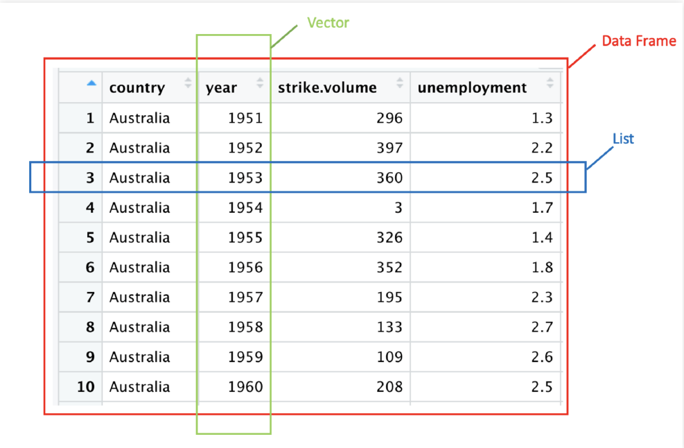

```{r setup, include=FALSE}
knitr::opts_chunk$set(echo = TRUE)
options(dplyr.summarise.inform = FALSE)
library(tidyverse)

```

## Today's agenda:  

- Vectors
- Data types
- `data.frame`s and `tibble`s

# Vectors: the foundational data structure in R 


## Vectors store an arbitrary^[Within limits determined by hardware] number of *same* type items

Use `c()` to build vectors
  
```{r}
# numeric vector of length 6
my_numbers <- c(1, 2, 3, 4, 5, 6)
my_numbers

# character vector of length 3
my_characters <- c("public", "policy", "101")
my_characters
```


## Vectors are the smallest unit of data in R

```{r}
# vectors of length 1
i_am_a_vector <- 12.0
as_am_i <- TRUE

is.vector(i_am_a_vector)
is.vector(as_am_i)
```


## The `c()` function combines vectors

```{r}
x <- c(c(1, 2, 3), c(4, 5, 6))
x
y <- c(x, 2022)
y
```

## i.e. `c()` "adds" elements to a vector

```{r}
z <- c("Bo", "Cynthia", "David")
z
z <- c(z, "Ernesto")
z
z <- c("Amelia", z)
z
```

Technical detail: creates new objects in memory!

##  Create vectors of *`seq()`uential* numbers with `:` and `seq()`

```{r}
too_much_typing <- c(2, 3, 4, 5)
2:5
seq(2, 5)
seq(from = 2, to = 5, by = 1)
```

##  Create `rep()`eated vectors

```{r}
too_much_typing <- c("a", "a", "a", "a")
rep("a", 4)
```


## Can you explain what is going on?

```{r, eval = TRUE}
rep(c("a", 5), 4)
rep(c("a", 5), each = 4)
```

## Creating placeholder vectors of a given type 

```{r}
too_much_typing <- c("", "", "", "", "", "")

vector("character", length = 5) 

# or this shorter short-cut.
character(5) 
```


## Creating placeholder vectors of a given type

```{r}
# 1 million 0s
my_integers <- integer(1000000)
head(my_integers)
# 1 million FALSEs
my_lgl <- logical(1e6)
head(my_lgl, 3)
```

## Create *random* data following a distribution

```{r}
# Randomly choose 3 numbers from a Normal distribution
(my_random_normals <- rnorm(3))
# Randomly choose 4 numbers from a Uniform distribution
(my_random_uniforms <- runif(4))
```


The pattern is **r**`distribution` (**r**`unif`, **r**`norm`, **r**`f`, **r**`chisq`)


# Vectorization

## R is a vectorized language

"Vectorized" means do something to a vector **element by element**

- In non-vectorized languages (e.g. Python, Java), you use a loop.

- Other vectorized languages include: Julia, MATLAB, numpy library in Python

## Math is vectorized

Do the operation **element by element**

```{r}
my_numbers <- 1:6
# 1 + 1, 
# 2 + 2, 
# 3 + 3, 
# 4 + 4, 
# 5 + 5, 
# 6 + 6
my_numbers + my_numbers 
```


## Add a single value to a vector

Do the operation **element by element** 

- if one vector is "short", recycle it's elements.


```{r}
# 1 + 6, 
# 2 + 6, 
# 3 + 6, 
# 4 + 6, 
# 5 + 6, 
# 6 + 6
my_numbers + 6
```

## Many built-in functions are vectorized.

- This may remind Excel users of "dragging" a function

```{r}
# sqrt(1)
# sqrt(2)
# sqrt(3)
# sqrt(4)
# sqrt(5)
# sqrt(6)
sqrt(my_numbers)
```

## You try: Guess the output before running the code

```{r, eval = FALSE}
my_numbers <- 1:6
my_numbers - my_numbers
my_numbers * my_numbers 
my_numbers / my_numbers 
```
  
```{r, eval = FALSE}
a_vector <- rnorm(6) 
sqrt(a_vector) 
round(a_vector, 2)
```

## What happens when the vectors aren't the same size?


```{r, message=FALSE}
a <- 1:6 + 1:3
a
```

## Warning: Vector recycling

The shorter vector re-starts from it's beginning.

```{r, message = FALSE}
# 1 + 1, 
# 2 + 2, 
# 3 + 3, 
# 4 + 1, -- '1' is 'recycled' 
# 5 + 2, -- '2' is 'recycled'
# 6 + 3  -- '3' is 'recycled'
c(1, 2, 3, 4, 5, 6) + c(1, 2, 3)
```


##  Some times we get a warning ...

```{r, message = TRUE}
x <- c(1, 2, 3, 4, 5, 6) + c(1, 2, 3, 4, 5)
```

... but not if vector lengths are multiples

```{r, message = TRUE}
x <- c(1, 2, 3, 4, 5, 6) + c(1, 2, 3)
```

## Conditional operators are vectorized

```{r}
# 1 > 1, 
# 2 > 1, 
# 3 > 3, 
# 4 > 3, 
# 5 > pi, 
# 6 > pi

my_numbers > c(1, 1, 3, 3, pi, pi)
```

## Conditional operators are vectorized

```{r}
x <- c(1, 3, 6, 10)
# 4 is "recycled" think c(4, 4, 4)
x > 4 
x == 3 
```

## Warning: Vector recycling still an issue

You want to see if a value is equal to 1 or 6
```{r}
# FAIL
x == c(1, 6)
```


## You want to see if a value is equal to 1 or 6

```{r}
# FAIL
x == c(1, 6)
```

```{r}
# Success!
x == 1 | x == 6
```

## Boolean operators are vectorized

```{r}
# TRUE & TRUE
# TRUE & FALSE
# FALSE & TRUE
# FALSE & FALSE
rep(c(TRUE, FALSE), each = 2) & rep(c(TRUE, FALSE), 2)
```

## Boolean operators are vectorized

```{r}
# TRUE | TRUE
# TRUE | FALSE
# FALSE | TRUE
# FALSE | FALSE
rep(c(TRUE, FALSE), each = 2) | rep(c(TRUE, FALSE), 2)
```


## `xor()` exists in baseR as a function!

See section 13.3 of R4DS

```{r}
# TRUE | TRUE.
# TRUE | FALSE
# FALSE | TRUE 
# FALSE | FALSE
xor(rep(c(TRUE, FALSE), each = 2), rep(c(TRUE, FALSE), 2))
```

## Working with characters

  - `paste0()` is a function that combines character vectors
  - `str_c()` is a tidyverse cousin

```{r, eval=TRUE}
paste0(c("a", "b", "c"), c("x", "y", "z"))
```

```{r, eval=TRUE}
paste0("a", "w", "e", "s", "o", "m", "e")
```


# Subseting Vectors

## Accessing Elements by Index with Brackets `[`

```{r}
z
z[3]
z[c(1, 2, 3)]
```

## Reassign Elements by Index

```{r}
z[1] <- "Arthur"
z[1:3]

```


## Excluding Elements by Index

Using a negative sign, returns everything *except* the selected one(s):

```{r}
my_letters <- c("a", "b", "c", "d", "e")
# get all numbers besides the 1st 
my_letters[-1]
# get all numbers besides the 4th and 5th
my_letters[-c(4, 5)]
```

## Try it out:

```{r}
a <- 0:9
```

- subset the number 7
- subset all the numbers not equal to 8 or 9
- subset all the even numbers

## Try it out:

```{r}
a[8]
a[-c(9, 10)]
a[c(1, 3, 5, 7, 9)]
```


## Accessing Element by Logical Vector

```{r, eval = TRUE}
logical_index <- 
  # 1,    2,    3,     4,     5,    6,
  c(TRUE, TRUE, FALSE, FALSE, TRUE, FALSE)
```

```{r}
# same as my_numbers[c(1, 2, 5)]
my_numbers[logical_index]
```


## Accessing Element by Logical Vector

```{r, eval = TRUE}
# 1  subset TRUE
# 2  subset TRUE
# 3  subset FALSE
# 4  subset FALSE
# 5  subset TRUE
# 6  subset FALSE
my_numbers[logical_index]
```


## Accessing elements that meet a condition (i.e. Logical Vector)

```{r}
x <- c(-3, -2, 15, 11, -12, 13)
x < 0
x[x < 0]
```


## Reassigning elements that meet a condition 

```{r}
# Replace elements which meet the condition with 0
x[x < 0] <- 0
x
```

## Try it out -- with conditional expressions / logical vectors:

```{r}
a <- 0:9
```

- subset the number 7
- subset all the numbers not equal to 8 AND are not equal to 9
- subset all the even numbers

## Try it out:

```{r}
a[a == 7]
a[a != 8 & a != 9]
a[a %% 2 == 1]
```


#  Functions that reduce vectors

## `length()` tells you how many items in the vector

```{r}
# letters is the English alphabet
head(letters)
length(letters)
```


## Summarize your data

```{r, echo=FALSE}
a_vector <- c(1, 3, 5, 7, 15)
```

```{r, eval=FALSE}
a_vector <- c(1, 3, 5, 7, 15)
sum(a_vector)      # add all numbers 
mean(a_vector)     # find the mean
median(a_vector)   # find the median
sd(a_vector)       # find the standard deviation
```


## Generalize logical operators


Generalize `|` with `any()`
```{r}
# 1 > 12 | 3 > 12 | 5 > 12 | 7 > 12 | 15 > 12
any(a_vector > 12) 
```


Generalize `&` with `all()`
```{r}
# 1 == 5 & 3 == 5 & 5 == 5 & 7 == 5 & 15 == 5
all(a_vector == 5) 
```


## Functions that reduce vectors

Useful functions to summarize data

- Center: mean(), median()
- Spread: sd(), IQR(), mad()
- Range: min(), max(), quantile()
- Position: first(), last(), nth(),
- Count: n(), n_distinct()
- Logical: any(), all()


# Data Types

## What is going on here?

```{r, eval=FALSE}
a <- "4"
b <- 5
a * b
```

Error in a * b : non-numeric argument to binary operator


## What is going on here?

The error we got when we tried `a * b` was because `a` is a character:

```{r, eval=FALSE}
a <- "4"
b <- 5
a * b # invalid calculation
```

R does not multiply *non-numeric* vectors! 


## Data types

R has four primary types of atomic vectors 
  
  - these determine how R stores the data in memory
  
  {}
^[Image from https://adv-r.hadley.nz/vectors-chap.html]

## Data types
logicals, also known as booleans
```{r}
type_logical <- FALSE
type_logical <- TRUE
```

integer and double, together are called: numeric

```{r}
type_integer <- 1000
type_double <- 1.0
```

character, need to use " " to include the text
```{r}
type_character <- "abbreviated as chr" 
type_character <- "also known as a string"
```

## Testing types with `is.<type>()`
\footnotesize
```{r}
x <- "1"
typeof(x) # for atomic vectors, same as class() 
is.integer(x)
is.character(x)
```

\tiny <!--Keep this here b/c slide is the reference -->
technical: `typeof()` returns types built-in to R.  When we develop new structures, we can assign our own `class()`; class allows for more nuanced results (more later). You might also see people use `mode()`, which is nearly a synonym of `typeof()`.

## Reassign types on the fly `as.<type>()`

The error we got when we tried `a * b` was because `a` is a character:

```{r}
a <- "4"
b <- 5
as.numeric(a) * b
```

## What Happens When You Mix Types Inside a Vector?
```{r, eval=FALSE}
c(4, "harris")
c(TRUE, "harris")
c(TRUE, 5)
c(FALSE, 100)
```

## Character > Numeric > Logical
```{r}
# Numbers can be coerced into Characters.
c(4, "harris")

# Logicals are coercible to numeric or character. 
c(TRUE, "harris")
c(TRUE, 5)
c(FALSE, 100)
```

## Automatic coercion

We make use of logical coercion a lot.

What do you think the following code will return?
```{r, eval=FALSE}
TRUE + 10
sum(c(TRUE, TRUE, FALSE, FALSE, TRUE))
mean(c(TRUE, TRUE, FALSE, FALSE, TRUE))
```

## Automatic coercion

```{r, eval=TRUE}
TRUE + 10
sum(c(TRUE, TRUE, FALSE, FALSE, TRUE))
mean(c(TRUE, TRUE, FALSE, FALSE, TRUE))
```

## Automatic coercion only works from simple to complex


```{r, eval = FALSE}
# Since Character > Numeric R won't turn "4" into 4
"4" + 4
```
Error in "4" + 4 : non-numeric argument to binary operator


```{r}
# But, it will turn 4 into "4"
paste0("4", 4)
```


## NAs introduced by coercion

R does not know how to turn the string "unknown" into an integer. So, it uses `NA` which is how R represents *missing* or *unknown* values. 

```{r}
as.integer("Unknown")
```

## `NA`s are contagious

`NA` could be **anything** so the output is also *unknown*

```{r}
NA + 4
max(c(NA, 4, 1000))
mean(c(NA, 3, 4, 5))
4 == NA
```

## Some functions let you ignore the missing values

```{r}
b <- c(NA, 3, 4, 5)
sum(b)
sum(b, na.rm = TRUE)
mean(b, na.rm = TRUE)
```


## Do you remember how to test for missing values?

```{r}
x <- c(4, NA)
x == NA
```


## Test for `NA`s with `is.na()`

```{r}
x <- c(4, NA)
is.na(x)
!is.na(x)
```


# Lists

## What do we do we when we want to store different types?


```{r}
c(TRUE, c(2,2,2), "Last")
```


## What do we do we when we want to store different types?
\footnotesize
Use lists! 

Lists are useful building blocks for:

  - data frames / tibbles
  - output from statistical models

```{r}
# vector coercion
typeof(c(1, "a", TRUE)) 
# no-coercion
typeof(list(1, "a", TRUE))
```


## List
\footnotesize
We can name the objects in a list for easy reference.

```{r}
my_list <- list(can = c(TRUE, TRUE), 
                hold = c(2, 2), 
                anything = c("last", "last"))
str(my_list)
```
... Hey that looks like a data frame!

## Lists
\footnotesize
`[[` and `$` pull out a single object from a list by name or location.

```{r}
my_list[[2]]
typeof(my_list[[2]])


my_list$anything
typeof(my_list$anything)
```

## Lists
\footnotesize
We can also subset a `[` list and retain a list

```{r}
my_list[c(1,3)]
# this is still a list
typeof(my_list[c(1,3)])
```

## Lists are vectors?

- lists are still vectors, just not **atomic**
```{r}
is.vector(my_list)
```

{width=50%}

^[image from https://r4ds.had.co.nz/vectors.html]

## Empty list creation

To create an empty list of a given size use `vector()`
```{r}
empty_list <- vector("list", 10)
```


# Data Frames are lists with specific properties

## Data Frame,  Vector,  List

\footnotesize
  {}
  
  - Row: holds elements of different types (e.g. numeric, character, logical)
  - Column: store elements of the same type
  

##   We like `tidy` data 
 
  - Row: A distinct observation
  - Column: A feature or characteristic of that observation
 
\footnotesize
  {}
  
  *What columns define a distinct observation?*


## Columns are vectors

We can create a tibble or data.frame manually 

- To test out code on a simpler tibble
- To organize data from a simulation

```{r}
care_data <- tibble(
  id = 1:5,
  n_kids = c(2, 4, 1, 1, NA),
  child_care_costs = c(1000, 3000, 300, 300, 500),
  random_noise = rnorm(5, sd = 5)*30
)
```

Could create the same code with `data.frame()`


## Ta-da

Take a look at our data set `care_data`:

```{r}
care_data
```


## Rows are lists

(we make use of this idea less often.)

```{r}
bind_rows(
  list(id = 1, n_kids = 2, child_care_costs = 1000),
  list(id = 2, n_kids = 4, child_care_costs = 3000),
  list(id = 5, n_kids = NA, child_care_costs = 500)
)
```


## In fact, the whole data.frame/tibble is a list

```{r}
typeof(storms)
```

- This says that the tibble use `list` like storage-mode

```{r}
class(storms)
```

- This says `storms` inherits the properties of "tbl_df" "tbl" and "data.frame"
- This effects how the data interacts with functions 
  - e.g. compare `print(mtcars)` (a "data.frame") and `print(storms)` 

## Why do you keep saying `tibble`?

tibble is the tidyverse "subclass" of base R's `data.frame`

- tibbles print nicer  
- tibbles avoid niche issues/gotchas that you get with `data.frame`
  - see `?tbl_df` for the tidyverse-people's detailed spiel


## Base R ways to pull out a column as a vector:

```{r}
# base R way
care_data$n_kids
# base R way (same result as above)
care_data[["n_kids"]]
```

## Two base R ways to pull out a column as a tibble/data.frame:

```{r}
care_data["n_kids"]
```

```{r, eval = FALSE}
# recall n_kids is the second column!
care_data[2]
care_data[c(FALSE, TRUE, FALSE, FALSE)]
```

## Subsetting and extracting

Notice similarity with lists

- `[[` and `$` for extracting (or pulling)

vs.

- `[`  for subsetting / selecting.

\medskip
*Idea: a data frame is a named list with equal length vectors for each object (i.e. columns)*

## subsetting `[]` vs `[,]`

We saw that using `[]` pulls out columns. ("single index")

Using `[ , ]` allows us to  subset rows and columns. ("double index")

`data[` filter rows , select columns `]`


## Using `[` with two indices

`data[` filter rows ,   `]`

```{r}
care_data[c(1, 3), ]
```
## Using `[` with two indices

`data[`  , select columns `]` is equivalent to single index `data[get columns]`


```{r}
# gets same results as single-bracket care_data[c("id", "n_kids")]
care_data[, c("id", "n_kids")]
```

## Using `[` with two indices


`data[` filter rows , select columns  `]`

```{r}
care_data[!is.na(care_data$n_kids), c("id", "n_kids")]
```


## Recap

We discussed how to:

- Create vectors, lists and data frames for various circumstances
- Do vectorized operations and math with vectors
- Subset vectors and lists
- Understand data types and use type coercion when necessary


## Next steps

Lab:

- *Today:* Vectorized math
- *Tomorrow:* Using `[` for data analysis

**Touchstone: I can subset and extract from data and vectors with `[`**

Next lecture:

- Using *dplyr* for data exploration! 

(If you want to get ahead go through section 5.1-5.5 of `r4ds.had.co.nz`)


# Appendix A: Subsetting with `[`,`]` 


## Using `data[` subset rows ,  *subset columns* `]`

We can refer to columns by name or index location.

```{r}
care_data[1:2, c("n_kids", "child_care_costs")]
```

## Using `data[` subset rows ,  *subset columns* `]`

Or even a logical vector. (... this should remind you of vector subsetting!!)

```{r}
care_data[1:2, c(TRUE, FALSE, TRUE, FALSE)]
```

## Using `data[` *subset rows* ,  subset columns `]`

Similarly for rows!

```{r}
care_data[c(1,3), c("id","n_kids")]
```
```{r}
logical_indexing <- c(TRUE, FALSE, TRUE, FALSE, FALSE)
care_data[logical_indexing , c("id","n_kids")]
```

## Using `data[` *subset rows* ,  subset columns `]`

More usual usage for logical indexing

```{r}
logical_index <- care_data$id < 3
care_data[logical_index, c("id","n_kids")]
```

```{r, eval = FALSE}
# put the conditional right into the brackets.
care_data[care_data$id < 3 , "id"]
```


## Let's get you to try. 

First, we need data. 

`us_rent_income` is a practice data set that comes tidyverse.

```{r}
library(tidyverse)
head(us_rent_income)
```


## Testing out  `data[` *subset rows* ,  subset columns `]`

Explore `us_rent_income` quickly with `glimpse()` and `head()`

How would you use a single bracket `[` ...

1. to select the state names and variable columns?
2. to get the rows 1, 3, 5, 7 ?
3. to get all the rows about "income".^[hint: test if *something* `== "income"`?]
4. to get the `variable` and `estimate` columns for rows about Illinois?


## More examples `[`

```{r, eval = TRUE}

# 1
us_rent_income[c("NAME", "variable")] # with single indexing
us_rent_income[,c("NAME", "variable")] # with double indexing
us_rent_income[,c(2,3)]

# 2
us_rent_income[c(1,3,5,7),]

# 3
us_rent_income[us_rent_income$variable == "income",]

# 4
us_rent_income[us_rent_income$NAME == "Illinois", c("variable", "estimate")]
```


