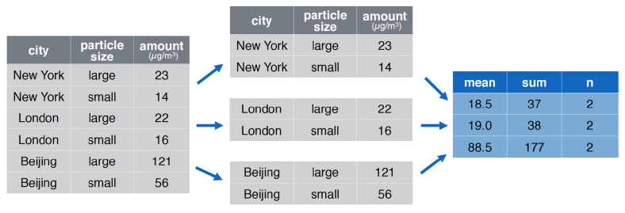

```{r, setup=TRUE, include = FALSE}
library(tidyverse)
library(readxl)
library(readr)
options(dplyr.summarise.inform = FALSE)
# knitr::opts_chunk$set(collapse = TRUE, comment = "#>", highlight = TRUE, fig.align="center")
# knitr::opts_chunk$set(echo = TRUE, fig.align="center")

wid_data <-   read_xlsx("../../labs/Data/world_wealth_inequality.xlsx",
                        col_names = c("country", "indicator", "percentile", "year", "value")) |>
      separate(indicator, sep = "[\\r]?\\n", into = c("row_tag", "type", "notes", "empty")) |> 
  select(-c(row_tag, empty))
```


# Remember the world inequality data lab?

## First, you did the analysis for France


``` {r}
french_data <- 
  wid_data |> 
    filter(type == "Net personal wealth", 
           country == "France") |>
    mutate(perc_national_wealth = value * 100) 

french_data |> 
  filter(percentile == "p90p100") |> 
  filter(between(year, 1995, 2010)) |> 
  summarize(wealth_share_of_top_10 = 
              mean(perc_national_wealth, na.rm=TRUE))
```


## Then, you did the analysis for Russia

``` {r}
russian_data <- 
  wid_data |> 
    filter(type == "Net personal wealth", 
           country == "Russian Federation") |>
    mutate(perc_national_wealth = value * 100)

russian_data |> 
  filter(percentile == "p90p100") |> 
  filter(between(year, 1995, 2010)) |> 
  summarize(wealth_share_of_top_10 = 
              mean(perc_national_wealth, na.rm=TRUE))
```


# Then, we asked you try for Korea ...

# Could there be a way to work on each country's subset of data at the same time?

## `group_by()` is the answer!

```{r, eval = FALSE}
wid_data |> 
    mutate(perc_national_wealth = value * 100) |>
    filter(type == "Net personal wealth",
           percentile == "p90p100",
           between(year, 1995, 2010)) |> 
  group_by(country) |>
  summarize(wealth_share_of_top_10 = 
    round(mean(perc_national_wealth, na.rm=TRUE), 1))
```

## `group_by()` is the answer!

```{r, echo = FALSE}
wid_data |> 
    mutate(perc_national_wealth = value * 100) |>
    filter(type == "Net personal wealth",
           percentile == "p90p100",
           between(year, 1995, 2010)) |> 
  group_by(country) |>
  summarize(wealth_share_of_top_10 = 
    round(mean(perc_national_wealth, na.rm=TRUE), 1))
```


## Analyzing data by groups 


1. **"Split"** data into groups  

  - done silently with `group_by()` 

1. **Apply** - a function to each group

  - use `summarize()`, `mutate()` or any dplyr verb
  
1. **Combine** - the results back into a tibble


## split - apply - combine

  


- summarize by group with `group_by()` + `summarize()` 
- create new columns with `group_by()` + `mutate()` 
- Appendix: `filter()` data with group specific matching criteria


## Ungrouped data ...

```{r}
txhousing |> glimpse()
```


## **"split"** the data with `group_by()` (subtle)

- `group_by()` adds some meta-data about groups 
- otherwise, no difference

```{r}
group_by(txhousing, city) |>  glimpse()
```

## Let's make a tiny example

```{r}
ex_data <- 
  tibble(period = rep(c(1, 2), 2),
         group_col = c("a", "a", "b", "b"),
         x = c(10, 6, 7, 7))

str(ex_data)
```


## create a hidden tibble that lists the `.rows` that belong to each group

```{r}
grouped_ex_data <- 
  group_by(ex_data, group_col)
str(grouped_ex_data)
```

## Start with upgrouped summary statistics


- `summarize()` collapses data to one row
- The count function `n()` takes no arguments and returns the size of a group
\footnotesize
```{r}
txhousing |>
  summarize(n = n(),
            total_sales = sum(sales, na.rm = TRUE),
            total_volume = sum(volume, na.rm = TRUE),
            mean_house_price = total_volume / total_sales)
```

## **apply** and **combine** `summarize()` 

\footnotesize

now `summarize()` collapses a data to one row *for each group*
    
```{r}
annual_housing_prices <- 
  txhousing |>
  group_by(year) |>    # Let's see summary for each year!
  summarize(group_n = n(),
            total_sales = sum(sales, na.rm = TRUE),
            total_volume = sum(volume, na.rm = TRUE),
            mean_house_price = total_volume / total_sales)

head(annual_housing_prices, n = 3)
```

## Visualizing our summarized data with ggplot

```{r, fig.width=5, fig.height=2.5}
annual_housing_prices |> 
  ggplot(aes(x = year, 
             y = mean_house_price)) + 
  geom_line()
```


## What if we want the same trend by city?

\footnotesize
We can filter the data and then **split-apply-combine**

```{r}
txhousing |>
  filter(city == "Houston") |>
  group_by(year) |>
  summarize(group_n = n(),
            total_sales = sum(sales, na.rm = TRUE),
            total_volume = sum(volume, na.rm = TRUE),
            mean_house_price = total_volume / total_sales) |>
  head(3)
``` 

# What if we want annual data for every Texas city?


## We can group by multiple columns!

We now have $46 \text{ cities } \times 16 \text{ years } = 736$ groups!

```{r}
group_by(txhousing, city, year) |>  glimpse()
```


## Voilà
\footnotesize
```{r}
annual_city_housing_prices <- 
  txhousing |>
    group_by(city, year) |> # one tiny change!
    summarize(total_sales = sum(sales, na.rm = TRUE),
              total_volume = sum(volume, na.rm = TRUE),
              mean_house_price = total_volume / total_sales)
 
head(annual_city_housing_prices, n=5)
```

## How have Texas housing prices changed over time in certain cities?
\footnotesize
```{r, eval=FALSE}
annual_city_housing_prices |> 
  filter(city %in% c("Houston",  "Galveston")) |>
  ggplot(aes(x = year, y = mean_house_price)) + 
    geom_point() + 
    facet_wrap(facets = "city", nrow = 2)
```

## How have Texas housing prices changed over time in certain cities?
```{r, echo=FALSE}
txhousing |>
  group_by(city, year) |>
  summarize(total_sales = sum(sales, na.rm = TRUE),
            total_volume = sum(volume, na.rm = TRUE),
            mean_house_price = total_volume / total_sales) |> 
  filter(city %in% c("Houston",  "Galveston")) |>
  ggplot(aes(x = year, y = mean_house_price)) + 
    geom_point() + 
    facet_wrap(facets = "city", nrow = 2)
```

## Grouping + Summarizing: Base R vs Tidyverse 
\footnotesize
Tidyverse:
```{r, eval = FALSE}
txhousing |>
  group_by(city, year) |>
  summarize(mean_sales = mean(sales, na.rm = TRUE),
            sd_sales = sd(sales, na.rm = TRUE))
```

Base R: 
```{r, eval = FALSE}
# use formula to indicate grouping vars
aggregate(sales ~ city + year,
          data = txhousing,
          FUN = mean)
aggregate(txhousing$sales,
          by = list(city = txhousing$city, year = txhousing$year),
          FUN = sd, na.rm = TRUE)
```


## Ungrouping data
\footnotesize

```{r}
class(txhousing)
txhousing_grouped <- group_by(txhousing, year)
class(txhousing_grouped)
```

To get rid of groups, use `ungroup()`

```{r}
txhousing_grouped |>  ungroup() |> class()
```

## What's going on here?

```{r, message=FALSE}
txhousing_grouped |>
  select(-c(year, month, date, inventory)) |>
  head()
```

## grouped data require the grouping variable

We got the message:
```
Adding missing grouping variables: `year`
```

```{r}
txhousing_grouped |>
  ungroup() |>
  select(-c(year, month, date, inventory)) |>
  head()
```


## Try it yourself

`txhousing` loads with the tidyverse

1. Filter observations where `city` is "Brazoria County"
2. Next, determine total sales in each year
3. Plot the total sales over time
4. Create two variables to show the number of missing & non-missing obs for `sales` in Brazoria County.  

```{r, echo=FALSE, eval=FALSE}
# answer to q1, q2 and q3
txhousing |>
  filter(city == "Brazoria County") |>
  group_by(year) |>
  summarize(total_sales = sum(sales, na.rm = TRUE)) |> 
  ggplot(aes(x = year, 
             y = total_sales)) + 
  geom_point()
```

```{r, echo=FALSE, eval=FALSE}
# answer to q4
txhousing |>
  filter(city == "Brazoria County") |>
  group_by(year) |>
  summarize(
    n_miss_sales = sum(is.na(sales)),
    n_nonmiss_sales = sum(!is.na(sales)))
```

## What happened in 2003?

```{r, echo=FALSE, eval=TRUE}
# answer to q1, q2 and q3
txhousing |>
  filter(city == "Brazoria County") |>
  group_by(year) |>
  summarize(total_sales = sum(sales, na.rm = TRUE)) |> 
  ggplot(aes(x = year, 
             y = total_sales)) + 
  geom_point()
```

\footnotesize
- Whenever you aggregate data, pay attention to `NA`s
- count missing values `sum(is.na(x))` or non-missing values `sum(!is.na(x))`


## How do we get the summarized values back into the main dataset?

```{r}
ex_data |> 
  group_by(group_col) |> 
  summarize(group_mean = mean(x))
```


## **apply** and **combine** `mutate()` 

```{r}
ex_data |>
  group_by(group_col) |>
  mutate(group_mean = mean(x))
```

# How would you calculate the change in sales from year to year?

## Say your prof gives you the code ...

```{r}
txhousing |>
  group_by(city, year) |>
  summarize(sales = sum(sales, na.rm = TRUE)) |>
  group_by(city) |>
  mutate(diff_sales = sales - lag(sales)) |>
head()
```


## Let's make sense of the code

1. Why do we need `group_by()`?
2. What is `lag()` and how does it work?

```{r, eval=FALSE}
txhousing |>
  group_by(city, year) |>
  summarize(sales = sum(sales, na.rm = TRUE)) |>
  # new material ...
  group_by(city) |>
  mutate(diff_sales = sales - lag(sales))
```


## What is `lag()` and how does it work?

Consider the time series `x`. 

- Think of each row with `x` as the "present" 

```{r}
tibble(
  time = 1:6,
  x = c(4,2,4,1,6,8),   # the time series 
  lag(x),    # x past (1 row)
  lag(x, 2), # x past (2 rows)
  lead(x))   # x future
```

## If the timeseries is out of order ...

`lag()` and `lead()` still work, but not how you want

```{r}
tibble(time = c(2, 3, 5, 1, 4, 6), 
      x = c(4,2,4,1,6,8),
      lag(x),  # I take x shift it "down" ...  
      lead(x)) # I take x shift it "up" ...  
               # regardless of what x is.  
```

## ... put it back in order with `arrange()`

```{r}
tibble(
  time = c(2, 3, 5, 1, 4, 6),
  x = c(4,2,4,1,6,8),) |> 
  arrange(time) |> 
  mutate(lag(x),
         lead(x))   
```

## Why do we need `group_by()`?

We want to learn about growth from period 1 to period 2

- What goes wrong?

```{r}
ex_data |>
  mutate(x_lag = lag(x),
         x_diff = x - lag(x))
```


## **split-apply-combine** to get differences

```{r}
ex_data |>
  group_by(group_col) |>
  mutate(x_lag = lag(x),
          x_diff = x - lag(x))
```


## Grouped `mutate`: other window functions
<!-- At this point more or less will use rest of last years -->

- See the "Data transformation with dplyr" cheatsheet (page 2) for more vectorized window functions.

```{r}
ex_data |>
  group_by(group_col) |>
  mutate(cumulative = cumsum(x),
         # comparing values to summaries
         centered = (x - mean(x)))
```


## Grouped `mutate`: ranking
\footnotesize
```{r}
ex_data |> mutate(rank = row_number(x)) 
```

```{r}
ex_data |> group_by(group_col) |> mutate(rank = row_number(x)) 
```


## Grouped `mutate`: You want to rank sales within group. 

- (Try running the code without `group_by()` and carefully compare the results.)

```{r}
ranked_data <-
txhousing |>
  group_by(year, city) |>
  summarize(total_sales = sum(sales, na.rm = TRUE)) |>
  group_by(year) |>
  mutate(sales_rank = rank(desc(total_sales)))
```

## Grouped `mutate`: You want to rank sales within group.^[R has a variety of related functions see `?ranking`]

```{r}
ranked_data |> arrange(year, sales_rank) |> head(10)
```


##  You want to work with the top 5 cities for each year.

```{r}
ranked_data |>
  # we already added ranks! 
  filter(sales_rank <= 5) |>
  arrange(year, sales_rank) |>
  head()
```


# Wrapping up commonly used chunks of code


##  We often want to know how many observations (rows) are in groups ...

```{r}
midwest |>
  count(state, inmetro) |>
  head()
```
##  How would you get the same output with `group_by()`?


```{r, echo = FALSE}
midwest |>
  count(state, inmetro) |>
  head()
```

##  How does `count()`  work?

```{r}
midwest |>
  group_by(state, inmetro) |>
  summarize(n = n()) |> 
  ungroup() |>
  head(5)
```

##  `add_count()` is a useful short cut
 
Can you tell what `add_count()` does?

```{r}
txhousing |>
  select(city, year, sales) |>
  add_count(city, year) |>
  head(5)
```

##  How does `add_count()`  work?

```{r}
txhousing  |>
  select(city, year, sales) |>
  group_by(city, year) |>
  mutate(n = n()) |>
  ungroup() |>
  head(5)
```

## Try it yourself: Setup
\footnotesize 
`midwest` is a data set that comes bundled with `tidyverse`. 

- *Old way*: let's calculate the total population of Ohio in the following way:

```{r, eval = TRUE}
midwest |> filter(state == "OH") |>
  summarize(total_population = sum(poptotal))
```
    
- *New way*: With `group_by`, we calculate the total population of all the states at once!
    
```{r, eval = TRUE}
midwest |> group_by(state) |>
  summarize(total_population = sum(poptotal))
```

## Try it yourself: `group_by()`
\footnotesize
1. For each state in the `midwest` data, calculate the proportion of counties that are in a metro area (`inmetro`).^[Recall that `mean()` of a column of `0` and `1`s tell you the proportion of `1`s.]

2. Add a col to midwest called `pop_state` that equals the state population.

```{r, echo = FALSE, eval = FALSE}
# fill in the ... with appropriate code
midwest |>
  group_by( ... ) |>
  mutate(pop_state = ... )
```

3. Reproduce this table using `count()`.

```{r, echo = FALSE}
midwest |>
  group_by(inmetro) |>
  summarize(n = n())
```


4. For each county, determine how far the poverty rate (`percbelowpoverty`) is from the state average. Pull out data for Cook and Will counties.

```{r, echo = FALSE}
midwest |>
  group_by(state) |>
  select(county, state, percbelowpoverty) |>
  mutate(state_poverty_rate = mean(percbelowpoverty),
        county_diff = percbelowpoverty - state_poverty_rate) |>
  select(-percbelowpoverty) |>
  filter(county %in% c("COOK", "WILL"))
```


```{r, echo=FALSE, eval=FALSE}
# answer to q2
midwest |>
  group_by(state) |>
  summarize(prop_in_metro = mean(inmetro))
```

```{r, echo=FALSE, eval=FALSE}
# answer to q3
midwest |>
  group_by(state) |>
  mutate(pop_state = sum(poptotal)) 
```

```{r, echo=FALSE, eval=FALSE}
# answer
midwest |>
   count(inmetro)
```
    


## Recap: Analysis by group with `dplyr`

We learned the concept **split-apply-combine** and how to use it in tidyverse!


- summarize data by group with `group_by()` + `summarize()` 
- created new columns with `group_by()` + `mutate()` 
  - we saw `lag()` and `rank()`, but you could get 
    also add group-level stats like `mean()` and `median()`
- use `count()` and `add_count()` as short cuts for getting group level counts

## Next steps:

Lab:

- Today: Grouped analysis

**I can streamline analysis of subgroup data using group_by() and dplyr verbs**

Lecture:

- Tomorrow: Writing your own functions!


## Appendix

## **split-apply-combine** `filter`:

- we don't need sales_rank to filter by ranks!

```{r}
txhousing |>
  group_by(year, city) |>
  summarize(total_sales = sum(sales, na.rm = TRUE)) |>
  group_by(year) |>
  # we don't need sales_rank to filter by ranks!
  filter(rank(desc(total_sales)) <=  5) |>
  arrange(year, desc(total_sales)) |>
  head()
```

## Grouped `arrange`?

`arrange()` doesn't work on groups by default.

- has default argument `.by_group = FALSE`

```{r}
ex_data |>
  group_by(group_col) |>
  arrange(x)
```

## Aside: Grouped `arrange`

Set `.by_group = TRUE` 

```{r}
ex_data |>
  group_by(group_col) |>
  # this option is nice if you have many grouping cols
  arrange(x, .by_group = TRUE)
```

Same idea as ...

```{r, eval = FALSE}
ex_data |>
  arrange(group_col, x)
```
